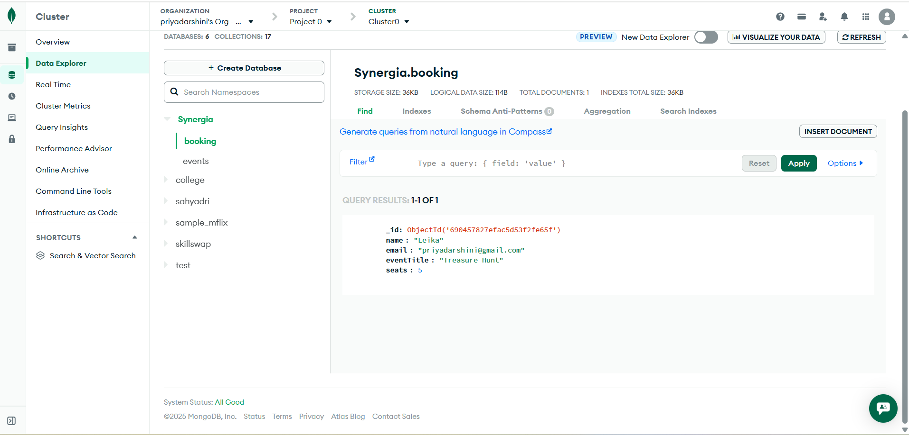

# Synergia Event Booking API

## Description
A Node.js & Express REST API for event booking with MongoDB integration.  
Allows users to perform CRUD operations on events and bookings, with search and filter functionality.

---

## Features
- **Events**
  - Create, Read, Update, Delete events
  - Fetch events by ID or date
- **Bookings**
  - Create new bookings
  - Get all bookings or booking by ID
  - Update booking by event title or email
  - Cancel booking
- Fully RESTful API
- MongoDB integration using `mongodb` client

---

## Tech Stack
- Node.js
- Express.js
- MongoDB
- dotenv for environment variables

---

## Quick start

1. Install dependencies:

```powershell
npm install
```

2. Create `.env` (copy `.env.example`) and set:

```
MONGODB_URI=mongodb+srv://<username>:<password>@cluster0.example.mongodb.net/?retryWrites=true&w=majority
```

3. Run:

```powershell
node .\server.js
```

## Important endpoints

- GET /events
- POST /events
- GET /api/bookings
- POST /api/bookings

## Screenshots

Add screenshots here (leave space for SS):



---

